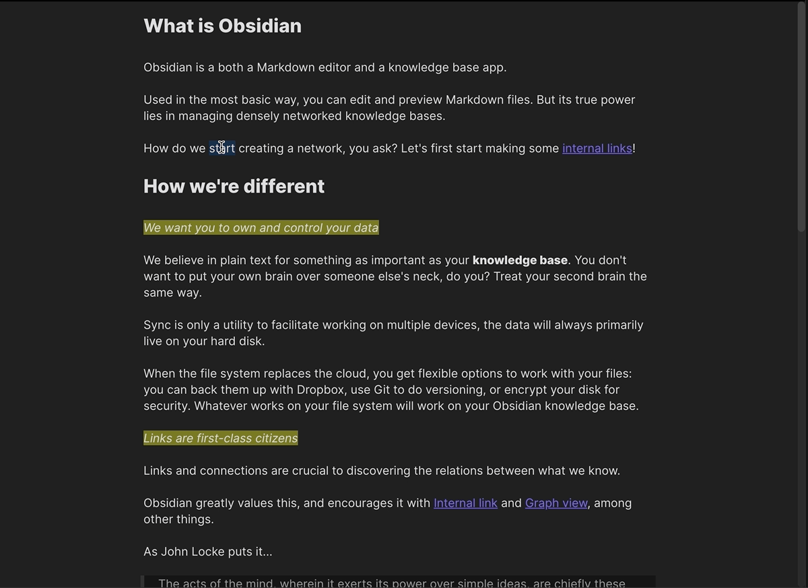

This is a simple and somewhat experimental [Obsidian](https://obsidian.md) plugin that incorporates limited Reading View functionality into Live Preview mode, allowing you to use it for both reading and editing.

Currently, this includes link behaviour (including clicking without holding down Ctrl/Cmd), minor rendering changes, and unfocusing on note open.

## Issues

Due to the workarounds that are used to make this plugin function, maximum compatibilty is not guaranteed. Nevertheless, if you experience problems, please report it as an issue.

## Installation

You can either obtain the plugin using Obsidian's built-in browser, or install it manually by putting it in your vault's `.obsidian/plugins` folder. If doing the latter, you'll need to run `npm i` in the plugin directory to initialise the npm package and download required sources. Then execute `npm run build`, which will compile the package's TypeScript files into JavaScript.
